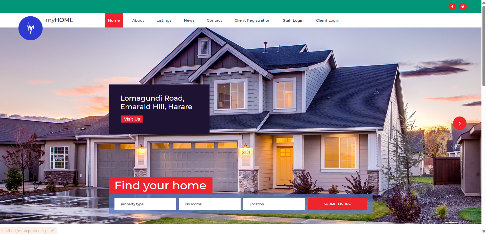
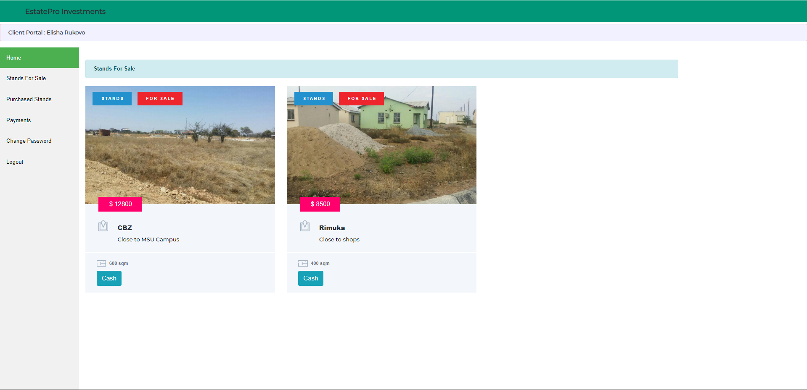
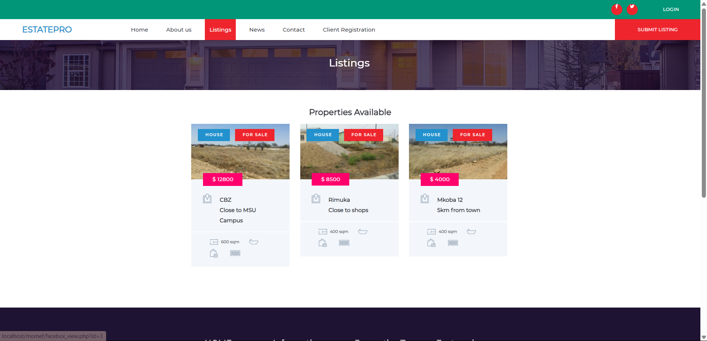
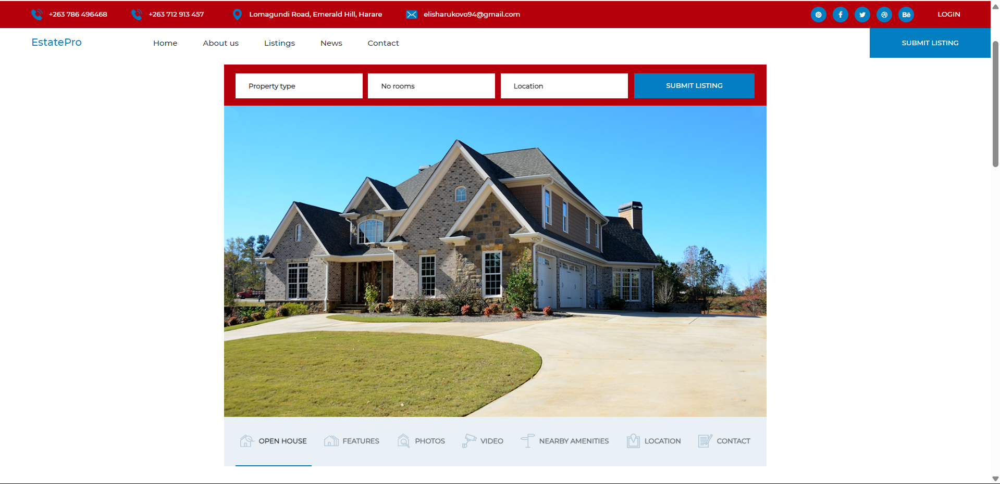

# 🏠 Stand Application and Allocation System (PHP)

[](https://www.php.net/)
[](https://www.mysql.com/)
[](LICENSE)

A **web-based application** that automates stand allocation based on user bids. After the application deadline, the system automatically awards the stand to the **highest bidder**. Built with PHP and MySQL, designed to expand into a full real estate platform.

## 🌟 Features
- User registration and login
- Apply for stands and submit bids
- Automatic allocation to highest bidder after deadline
- Admin panel to monitor applications and sales
- Modular design ready for future expansion (houses, rentals)

## 🛠️ Technologies
| Frontend         | Backend      | Database |
|-----------------|-------------|---------|
| HTML / CSS / JS | PHP         | MySQL   |
| Bootstrap (opt) |             |         |

## 💻 Screenshots
| Home         | Dashboard      | Listing |
|-----------------|-------------|---------|
|  |          |    |


## 🚀 Setup Instructions
1. Clone the repository:  
   ```bash
   git clone <repository-url>
   ```
2. Import the database `stand_system.sql` into MySQL.
3. Configure `config.php` with database credentials.
4. Start a local server (XAMPP, WAMP, or Laragon).
5. Open in browser: `http://localhost/<project-folder>`.

## 🤝 Contributing
- Complete the house selling module
- Improve bidding and allocation algorithms
- Enhance UI/UX
- Add security and validation improvements

## 📅 Roadmap
- [ ] House selling module
- [ ] Mobile-friendly interface
- [ ] Email notifications for winners
- [ ] Analytics dashboard

;

## 📄 License
MIT License