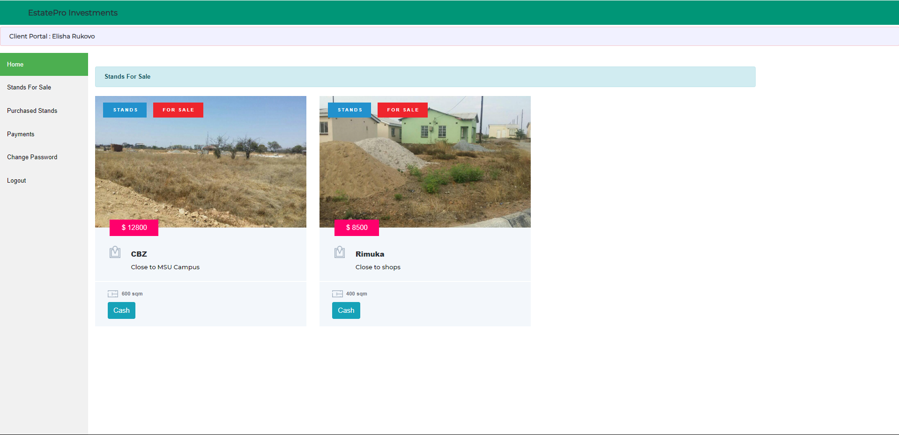
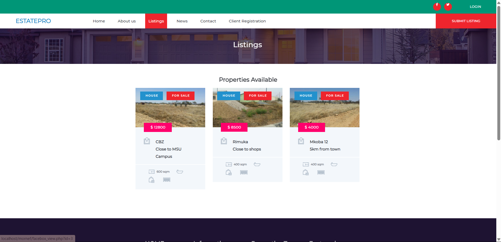
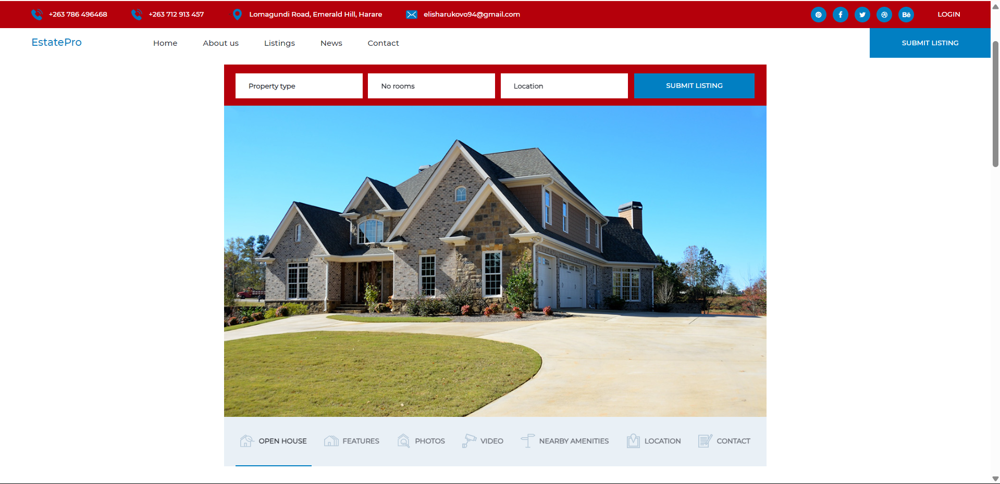

# EstatePro

Stand application and allocation system.

[](https://www.php.net/)
[](https://www.mysql.com/)
[](LICENSE)

---

## Overview

A web application that automates the process of applying for stands and allocating them based on submitted bids. After the application deadline, the system awards the stand to the highest bidder. Built with PHP and MySQL, designed to expand into a full real estate management platform.

---

## Features

- User registration and login
- Stand listings with application and bidding
- Automatic allocation to highest bidder after deadline
- Admin panel for monitoring applications, bids, and allocations
- Modular structure ready for houses, rentals, and analytics

---

## Screenshots

| Home | Dashboard | Listing |
|------|-----------|---------|
|  |  |  |



---

## Setup

1. Clone the repository
   ```bash
   git clone https://github.com/elisharukovo/estatepro.git
   ```

2. Import the database
   ```
   estatepro.sql
   ```

3. Configure `config.php` with your database credentials

4. Start a local server (XAMPP or similar) and open
   ```
   http://localhost/estatepro
   ```

---

## Roadmap

- House selling module
- Email notifications for allocation winners
- Mobile-friendly interface
- Analytics dashboard

---

## License

MIT
